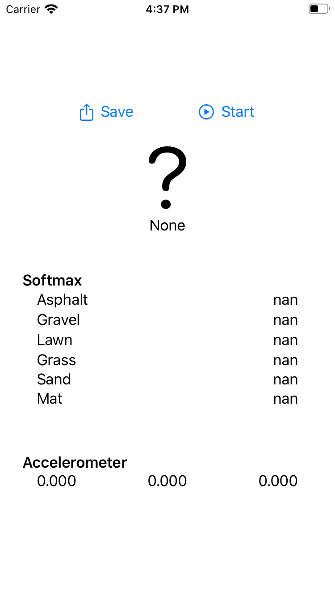

#  SidewalkSurfaceTypeClassification

This application can classify sidewalk surface type from acceleration data obtained by iPhone or iPod touch.

When you launch the app, press the start button, put your iPhone in your bottoms' pocket, and walk, it will estimate the sidewalk surface type you walk on.

The model of sidewalk surface type classifier was trained via `tensorflow.keras`, and converted to Core ML model (`.mlmodel`) by using `coremltools`.

|
:-:|:-:

## Requirements
- iOS 13.1+
- Xcode 11.5+

## Model
### Model Metadata
- Type: Neural Network Classifier
- Size: 18MB
- input: MultiArray (Double 768)
- output: classLabel (6 type)
    - asphalt
    - gravel
    - lawn
    - grass
    - sand
    - mat

### Model Architecture
This classifier is based on the model of VGG16 ([Very Deep Convolutional Networks for Large-Scale Image Recogniton](https://arxiv.org/abs/1409.1556) by K. Shimonyan et al.) adapted to sensor data.

Implementation of the model in `tf.keras` is [here](https://github.com/Shakshi3104/5-tornadoes).

Code of converting `tf.keras` to `.mlmodel` is [here](https://github.com/Shakshi3104/5-tornadoes/blob/master/east/networks/coreml.py).

#### Layer Distribution
|Layer Type|Num|
|:------------|:----:|
| ActivationReLU | 15 |
| Convolution | 13 |
| PoolingMax | 5 |
| Permute | 3 |
| InnerProduct | 3 |
| Reshape | 1 |
| Flatten | 1 |
| Softmax | 1 |

### Used Python Libraries
- Training the model: `tensorflow 2.1.0`
- Adding the Reshape layer for Core ML: `keras 2.2.4`
- Converting `.h5` model to `.mlmodel` model: `coremltools 4.0b1`

